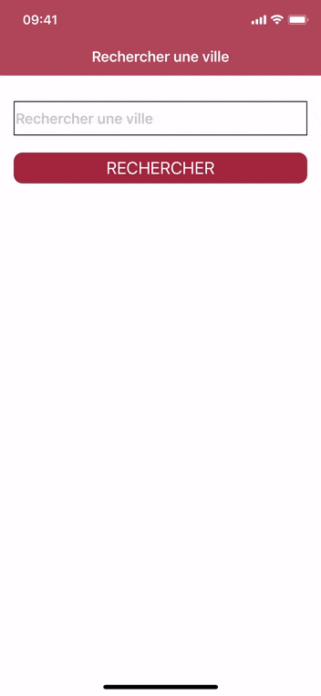
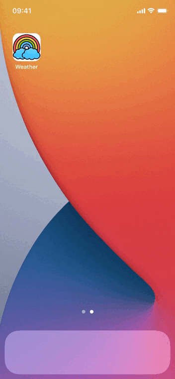

# Weather for Grafikart in Swift
## Application de météo pour Grafikart en Swift

Grafikart est train d'effectuer une application de météo avec "Kotlin/Android" pour tester/apprendre le language, sur ça chaine [**Twitch**](https://www.twitch.tv/grafikart) => et son [**live Twitch**](https://www.twitch.tv/videos/1069238101)

Je suis sur quand Swift, il galèrerait moins. Donc j'ai fait ce petit projet pour le motiver à (re)tester le Swift, en plus il a un M1 😉

C'est mon language préféré 🥰

(Je n'ai pas réussi à trouver les mêmes images, j'ai utilisé celles de l'api)

## ---- OLD
### TODO
- [X] Mettre les bonnes couleurs
- [X] Différencier la première cellule avec un autre design

